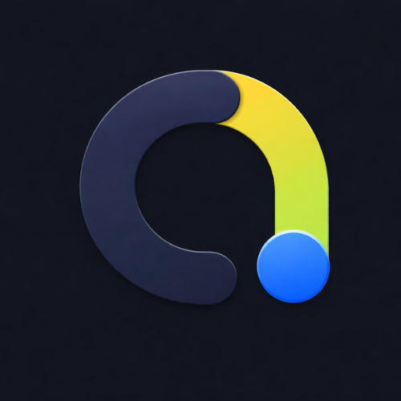
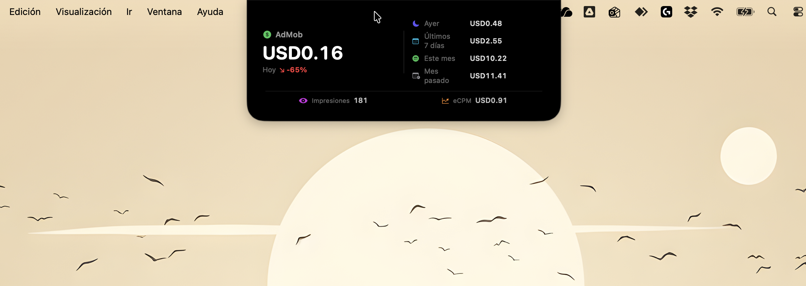
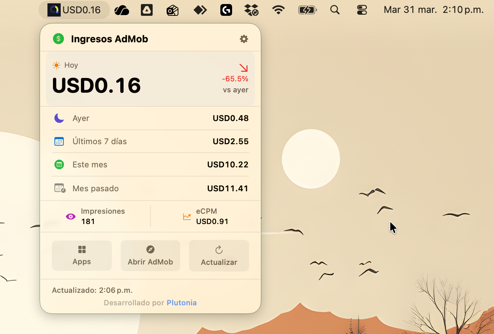

<p align="center">
  
</p>

<h1 align="center">AdMob Widget for macOS</h1>

<p align="center">
  A native macOS menu bar app that displays your Google AdMob estimated earnings in real-time.<br>
  Lives in your menu bar (next to the notch) and updates automatically.
</p>

<p align="center">
  
  
  
  
  
  
</p>

<p align="center">
  <a href="https://buymeacoffee.com/jjaracanales">
    
  </a>
</p>

---

<p align="center">
  
</p>

<p align="center">
  
</p>

---

## Features

### Menu Bar
- **Always visible earnings** - Your app icon + today's earnings in the menu bar
- **Detailed dropdown** - Today, yesterday, last 7 days, this month, last month
- **Trend indicator** - Percentage change vs yesterday (green/red arrow)
- **Impressions & eCPM** - See your ad performance metrics at a glance

### Notch Mode
- **Hover to reveal** - Move your mouse to the notch area and a dark panel expands from it
- **Smooth animations** - Panel grows/shrinks with easing transitions
- **Full metrics** - Today (large), yesterday, 7 days, this month, last month, impressions, eCPM
- **Non-intrusive** - Auto-hides when you move your mouse away

### Per-App Breakdown
- **All your apps** - See earnings for each app individually
- **Top apps chart** - Horizontal bar chart ranking your best performing apps
- **Platform badges** - Android / iOS labels for each app
- **4 time periods** - Today, yesterday, this month, last month per app

### Settings & Customization
- **7 languages** - English, Español, Português, Français, Deutsch, 日本語, 中文
- **Configurable refresh** - 15 min, 30 min, 1 hour, or 2 hours
- **Launch at login** - Start automatically with your Mac
- **Notch mode toggle** - Enable/disable the notch hover feature
- **Onboarding wizard** - Step-by-step setup guide built into the app
- **Open AdMob** - Quick link to open AdMob dashboard in your browser

### Privacy & Security
- **OAuth 2.0 with PKCE** - Secure authentication, tokens stored locally
- **No scraping** - Uses the official Google AdMob API (free, no rate limits)
- **No data sent to third parties** - Everything stays on your Mac
- **Zero dependencies** - 100% native Swift, no third-party libraries
- **Signed & notarized** - Approved by Apple, no security warnings
- **Open source** - MIT license, free forever

---

## Download

**Option 1: DMG (recommended)**

Download the latest DMG from [Releases](https://github.com/jjaracanales/AdMob-macOS/releases), open it, and drag AdMob Widget to Applications. Signed and notarized by Apple.

**Option 2: Build from source**

```bash
git clone https://github.com/jjaracanales/AdMob-macOS.git
cd AdMob-macOS/AdMobWidget
brew install xcodegen
xcodegen generate
open AdMobWidget.xcodeproj
# Press Cmd+R in Xcode
```

> **Note:** If building from source, open `project.yml` and replace `DEVELOPMENT_TEAM` with your own Apple Developer Team ID. Find yours at [developer.apple.com/account](https://developer.apple.com/account) under Membership Details.

---

## Setup Guide (English)

After installing the app, you need to set up Google API credentials (one-time, ~5 minutes).

### Step 1: Create a Google Cloud Project

1. Go to [console.cloud.google.com](https://console.cloud.google.com/)
2. Sign in with the **same Google account** you use for AdMob
3. Click the project selector at the top > **"New Project"**
4. Name it `AdMob` (or anything) > **"Create"**
5. Select the new project

### Step 2: Enable the AdMob API

1. Go to **APIs & Services > Library**
2. Search `AdMob API`
3. Click on it > click **"Enable"**

### Step 3: Configure OAuth Consent Screen

1. Go to **Google Auth Platform > Branding**
2. Fill in:
   - **App name**: `AdMob Widget`
   - **User support email**: your email
   - **Developer contact**: your email
3. Click **"Next"** through all steps > **"Create"**

### Step 4: Add Yourself as a Test User (CRITICAL)

> **Skip this and you'll get "access_denied 403" error.**

1. Go to **Google Auth Platform > Audience**
2. Under **"Test users"**, click **"Add users"**
3. Enter your **Gmail address** (same one you use for AdMob)
4. Click **"Save"**

### Step 5: Create OAuth Credentials

1. Go to **Google Auth Platform > Clients**
2. Click **"+ Create Client"**
3. Type: **Desktop app**
4. Name: `AdMob Widget`
5. Click **"Create"**
6. Click **"Download JSON"** -- save this file!

### Step 6: Configure the App

1. Click the **AdMob Widget icon** in your menu bar (top right, near the clock)
2. Click **"Select client_secret.json"** > pick the downloaded file
3. Click **"Sign in with Google"**
4. Authorize in browser (if you see "unverified app" warning, click Advanced > Continue)
5. **Copy the authorization code** Google shows you
6. Paste it in the app > click **"Submit"**
7. Done! Your earnings appear in the menu bar

### Troubleshooting

| Problem | Solution |
|---------|----------|
| **"access_denied" / 403** | Add yourself as test user (Step 4) |
| **Can't select the JSON file** | Make sure it ends in `.json` |
| **App not in menu bar** | Look for the AdMob icon near the clock |
| **"Invalid client" error** | Re-download the JSON from Google Cloud Console |
| **Earnings show $0.00** | Normal if you have no ad traffic yet |
| **Token expired** | The app auto-refreshes. If it breaks, sign in again |

---

## Architecture

```
+---------------+     OAuth 2.0      +--------------------+
|  AdMob        | ---- PKCE -------> |  Google OAuth      |
|  Widget       | <-- tokens ------- |  (accounts.google) |
|  (macOS)      |                    +--------------------+
|               |     REST API       +--------------------+
|               | -- Bearer token -> |  AdMob API         |
|               | <-- earnings ----- |  (admob.googleapis)|
+---------------+                    +--------------------+
       |
       v
+-------------------+
|  ~/Library/       |
|  Application      |
|  Support/         |  (tokens stored with file protection)
+-------------------+
```

## Tech Stack

- **SwiftUI** - Native macOS UI with `MenuBarExtra`
- **CryptoKit** - PKCE code challenge generation
- **URLSession** - HTTP networking
- **ServiceManagement** - Launch at Login
- **No dependencies** - Zero third-party libraries

## Project Structure

```
AdMobWidget/
  Sources/
    App/
      AdMobWidgetApp.swift       # App entry point, MenuBarExtra
      Assets.xcassets/            # App icon + menu bar icon
      Info.plist
      AdMobWidget.entitlements
    Views/
      OnboardingView.swift       # First-launch tutorial
      SetupView.swift            # OAuth setup wizard
      EarningsView.swift         # Main earnings display
      AppsView.swift             # Per-app breakdown with chart
      SettingsView.swift         # Settings panel
    Services/
      GoogleAuthService.swift    # OAuth 2.0 + PKCE
      AdMobAPIService.swift      # AdMob REST API client
      KeychainService.swift      # Secure token storage
      NotchService.swift         # Notch hover panel
      LaunchAtLoginService.swift # Launch at Login
      LocalizationService.swift  # 7 languages
    Models/
      AdMobModels.swift          # Data models
  project.yml                    # XcodeGen config
```

## Contributing

Contributions are welcome! Please:

1. Fork the repository
2. Create a feature branch (`git checkout -b feature/my-feature`)
3. Commit your changes
4. Push to the branch
5. Open a Pull Request

## Support the Project

If this app saves you time, consider buying me a coffee:

<a href="https://buymeacoffee.com/jjaracanales">
  
</a>

## License

MIT License - see [LICENSE](LICENSE) for details.

Made with care by [Plutonia](https://www.plutonia.cl)

---

## Guía Completa en Español

### Descargar

**Opción 1: DMG (recomendado)**

Descarga el DMG desde [Releases](https://github.com/jjaracanales/AdMob-macOS/releases), ábrelo y arrastra AdMob Widget a Aplicaciones. Firmado y notarizado por Apple.

**Opción 2: Compilar desde el código**

```bash
git clone https://github.com/jjaracanales/AdMob-macOS.git
cd AdMob-macOS/AdMobWidget
brew install xcodegen
xcodegen generate
open AdMobWidget.xcodeproj
# Presiona Cmd+R en Xcode
```

> **Nota:** Si compilas desde el código, abre `project.yml` y cambia `DEVELOPMENT_TEAM` por tu propio Team ID de Apple Developer.

### Configuración de Google Cloud Console

#### 1 -- Crear Proyecto
1. Ve a [console.cloud.google.com](https://console.cloud.google.com/)
2. Inicia sesión con tu cuenta de AdMob
3. Crea un proyecto nuevo llamado `AdMob`

#### 2 -- Habilitar API
1. Ve a **APIs y servicios > Biblioteca**
2. Busca `AdMob API` > **Habilitar**

#### 3 -- Pantalla de Consentimiento
1. Ve a **Google Auth Platform > Branding**
2. Nombre: `AdMob Widget`, tu email > **Crear**

#### 4 -- Usuario de Prueba (CRÍTICO)

> **Si te saltas esto, obtendrás error 403.**

1. Ve a **Google Auth Platform > Público**
2. En **Usuarios de prueba** > **Agregar usuarios**
3. Agrega tu Gmail > **Guardar**

#### 5 -- Crear Credenciales
1. Ve a **Google Auth Platform > Clientes**
2. **Crear cliente** > App de escritorio > `AdMob Widget`
3. **Descargar JSON**

### Configurar la App
1. Haz clic en el **icono de AdMob Widget** en la barra de menú (arriba a la derecha, cerca del reloj)
2. **Seleccionar client_secret.json** > elige el archivo descargado
3. **Sign in with Google** > autoriza en el navegador
4. Si dice "app no verificada": Avanzado > Ir a AdMob Widget
5. **Copia el código** que Google te muestra
6. **Pégalo** en la app > **Submit**
7. ¡Listo! Tus ganancias aparecen en la barra de menú

### Solución de Problemas

| Problema | Solución |
|----------|----------|
| **Error 403** | Agregarte como usuario de prueba (Paso 4) |
| **No puedo seleccionar el JSON** | Verifica que termine en `.json` |
| **No aparece en la barra** | Busca el icono de AdMob cerca del reloj |
| **Ganancias en $0.00** | Normal si no tienes tráfico de anuncios |

---

<p align="center">
  <a href="https://buymeacoffee.com/jjaracanales">
    
  </a>
</p>

<p align="center">
  <sub>Made with care by <a href="https://www.plutonia.cl">Plutonia</a> | Open Source | MIT License</sub>
</p>
